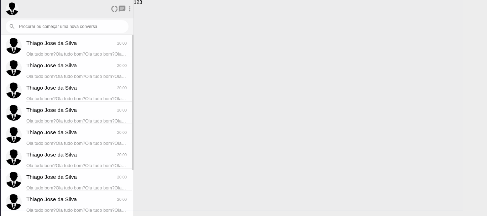

### Projeto whatsapp clone usando a tecnologia <b>REACJS</b>
- Projeto que tem o objetivo de estabelecer duas conversas ou mais entre os usuário cadastrados na plataforma.

- Dentro do <b>README</b> da pasta do projeto está tudo que foi ou está sendo usando.
   * https://github.com/thiagoadssilva/whatsappClone/blob/main/whatsapp/README.md

## <b>Parte Lateral</b> da pesquisa junto com a area das conversas.

